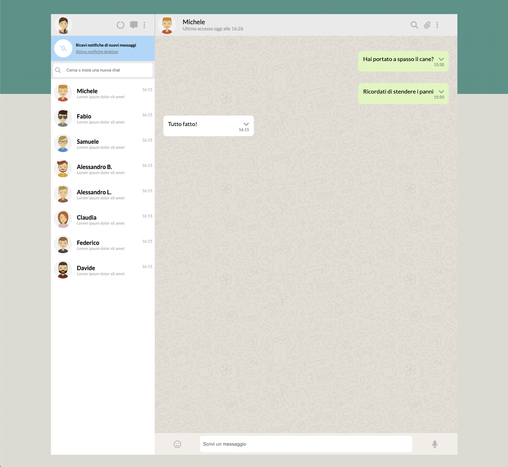

### ESERCIZIO
Replicare l'interfaccia di whatsapp, rendendola adaptive per i dispositivi: Mobile, Tablet e desktop.

Una volta che l'utente avrà inserito un messaggio all'interno dell'input al di sotto delle chat, riceverà un messaggio di risposta in 1 secondo.

Se l'utente vuole cercare un contatto all'interno della lista basterà inserire le iniziali, o il nome completo, all'interno dell'input sopra la lista dei contatti per trovare quello desiderato.

Volendo l'utente può anche eliminare il messaggio inviato andando sopra al messaggio con il mouse: Spunterà un menù a tendina con il quale potrà eliminare il mesaggio

---

**Milestone 1**
- [X] Replica della grafica con la possibilità di avere messaggi scritti dall’utente (verdi) e dall’interlocutore (bianco) assegnando due classi CSS diverse
- [X] Visualizzazione dinamica della lista contatti: tramite la direttiva v-for, visualizzare nome e immagine di ogni contatto

**Milestone 2**
- [X] Visualizzazione dinamica dei messaggi: tramite la direttiva v-for, visualizzare tutti i messaggi relativi al contatto attivo all’interno del pannello della conversazione
- [X] Click sul contatto mostra la conversazione del contatto cliccato

**Milestone 3**
- [X] Aggiunta di un messaggio: l’utente scrive un testo nella parte bassa e digitando
“enter” il testo viene aggiunto al thread sopra, come messaggio verde
- [X] Risposta dall’interlocutore: ad ogni inserimento di un messaggio, l’utente riceverà
un “ok” come risposta, che apparirà dopo 1 secondo.

**Milestone 4**
- [X] Ricerca utenti: scrivendo qualcosa nell’input a sinistra, vengono visualizzati solo i contatti il cui nome contiene le lettere inserite (es, Marco, Matteo Martina -> Scrivo “mar” rimangono solo Marco e Martina)

**Milestone 5**
- [X] Cancella messaggio: cliccando sul messaggio appare un menu a tendina che permette di cancellare il messaggio selezionato